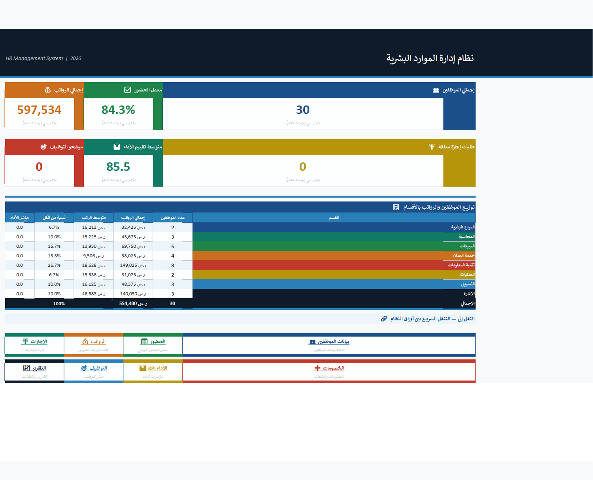
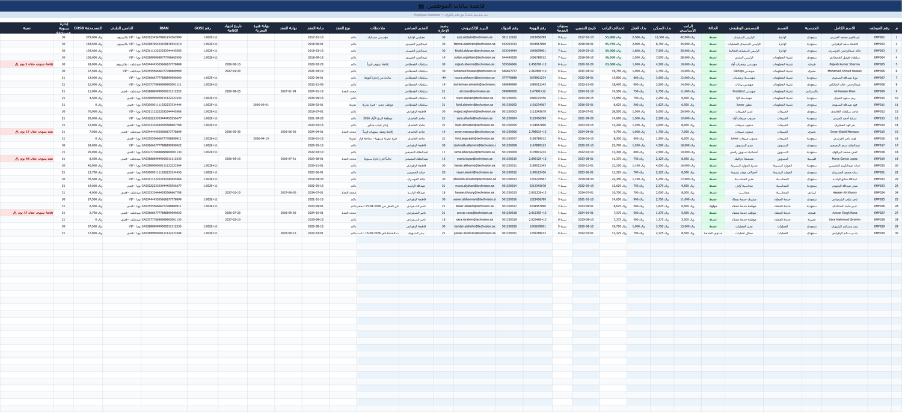
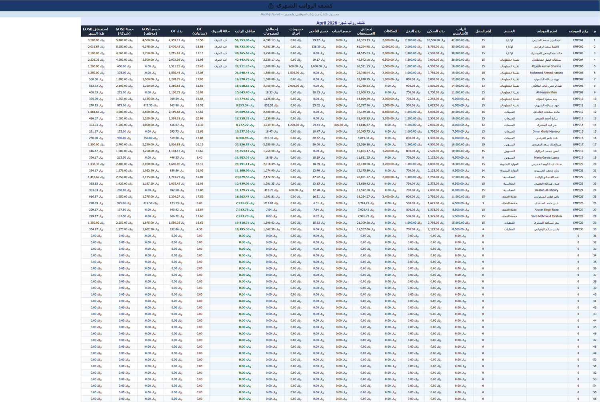
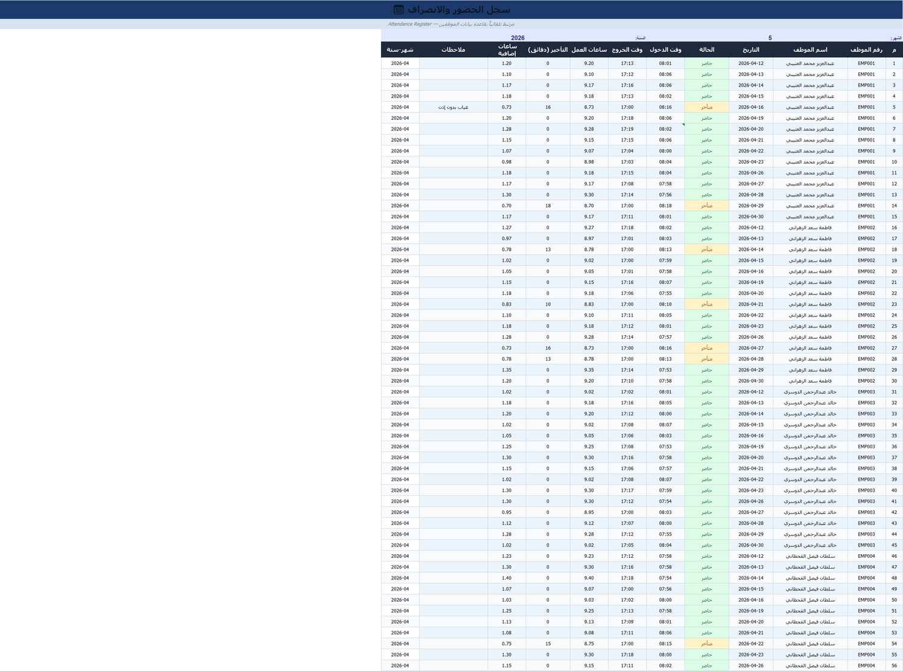
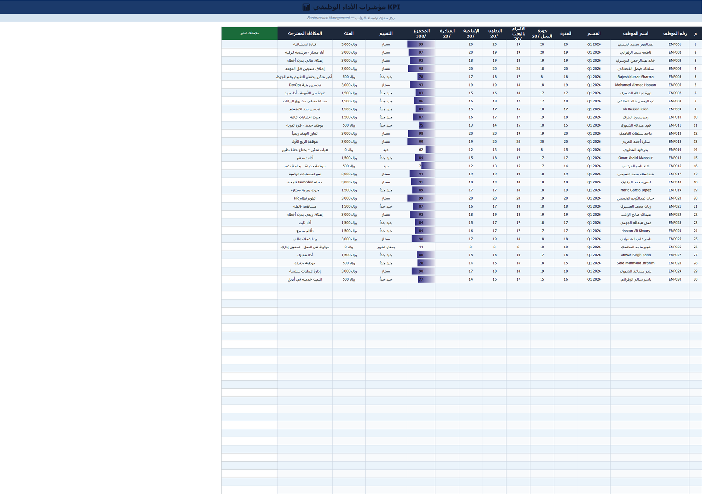
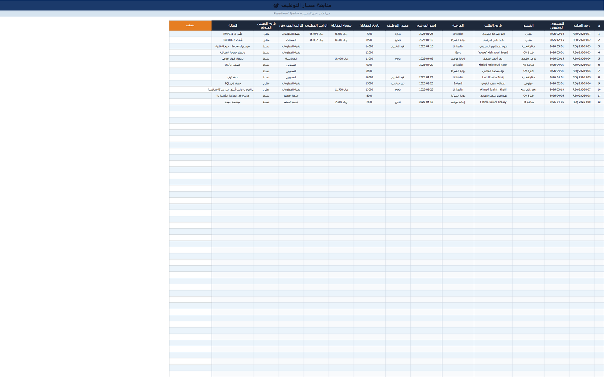
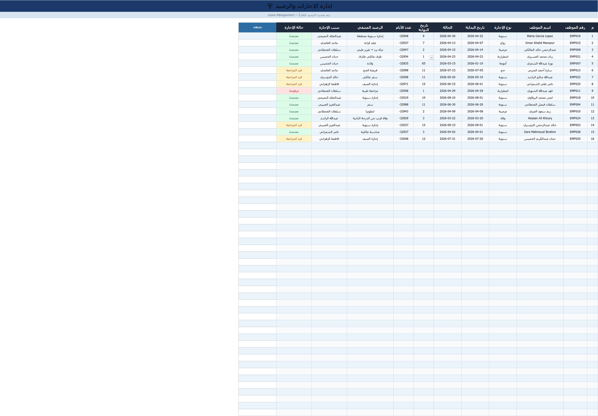
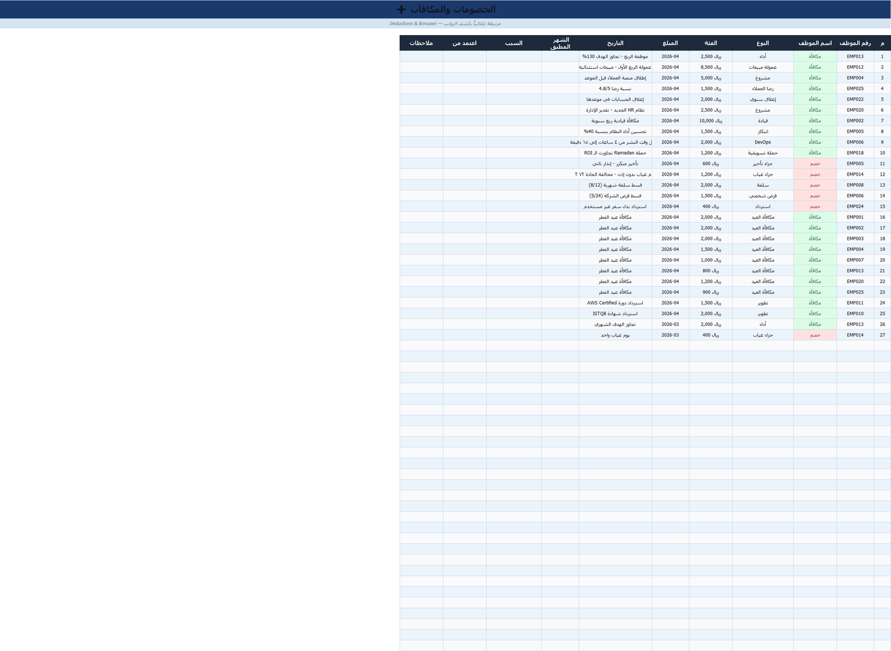
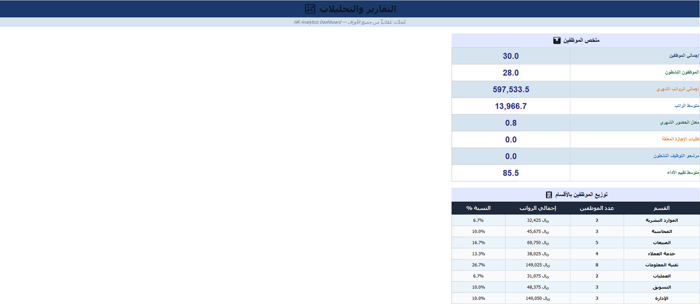

# HR System — Excel

A complete operational HR system in a single Excel file, for SMEs that don't need a cloud system. The bundled data is fully synthetic: 30 demo employees in a fictional company. The UI is Arabic (built Arabic-first).

Browse the sheets below, or [⬇️ download to open in Excel](https://github.com/ab1ob/hr-excel-system/archive/refs/heads/master.zip).

## Control panel

A company-wide view: total payroll, attendance rate, average performance, and the distribution of employees and salaries across departments — with navigation buttons to each module.

## Sheets

| Sheet | Purpose |
|-------|---------|
| Employees | Full record: contracts, IDs, Iqamas, base salaries |
| Payroll | Monthly run with automatic, settings-linked calculations |
| Attendance | Monthly presence, absence, and lateness per employee |
| KPI | Per-employee performance indicators |
| Recruitment | Hiring path and candidate tracking |

<b>View module sheets</b>

## Saudi-compliant calculations

- GOSI (social insurance) for Saudi and non-Saudi
- End-of-service benefit (EOSB) per labor law
- Iqama-expiry tracking

## Usage

[Download](https://github.com/ab1ob/hr-excel-system/archive/refs/heads/master.zip), open `نظام_HR_المتكامل.xlsx`, and start from the control panel. Replace the demo data with your own — all calculations are formulas that run automatically.

## License

MIT — use and modify freely.

[Home](https://github.com/ab1ob) · [Portfolio](https://github.com/ab1ob/portfolio)

