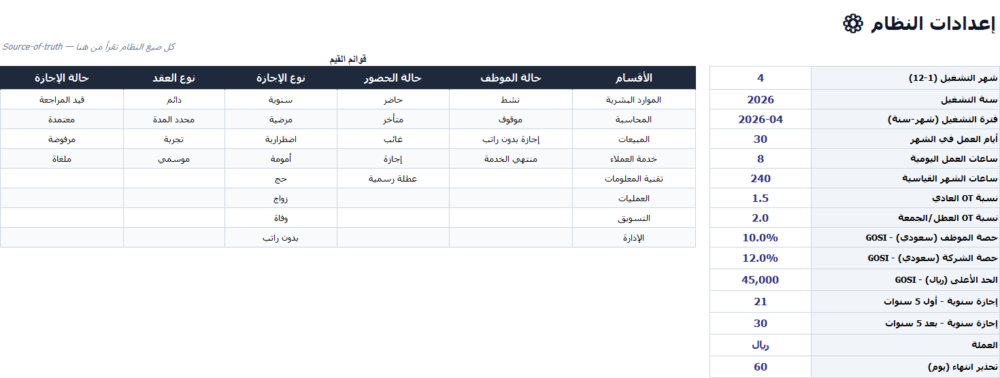

# نظام HR المتكامل — Excel

نظام موارد بشرية تشغيلي كامل في ملف Excel واحد، للمنشآت الصغيرة والمتوسطة التي لا تحتاج نظاماً سحابياً. البيانات المرفقة تجريبية بالكامل: ثلاثون موظفاً افتراضياً في شركة خيالية.

تصفّح الأوراق أدناه، أو [⬇️ حمّل النظام لتفتحه في Excel](https://github.com/ab1ob/hr-excel-system/archive/refs/heads/master.zip).

---

## لوحة التحكم

نظرة شاملة على المنشأة: إجمالي الرواتب، معدل الحضور، متوسط الأداء، وتوزيع الموظفين والرواتب على الأقسام — مع أزرار تنقل لكل وحدة.

## بيانات الموظفين

السجل الكامل لكل موظف: العقود، الهويات، الإقامات، الرواتب الأساسية والبدلات.

## الرواتب

مسير شهري بحسابات تلقائية مرتبطة بالإعدادات — الأساسي والبدلات والاستقطاعات والصافي.

## الحضور

متابعة شهرية للحضور والغياب والتأخير لكل موظف.

## مؤشرات الأداء (KPI)

مؤشرات أداء لكل موظف.

## التوظيف

مسار التوظيف ومتابعة المرشحين.

أوراق إضافية (اضغط للعرض)

### الإجازات

### الخصومات والمكافآت

### التقارير

### الإعدادات

---

## التوافق مع الأنظمة السعودية

- اشتراكات التأمينات الاجتماعية (GOSI) للسعودي وغير السعودي
- مكافأة نهاية الخدمة (EOSB) وفق نظام العمل
- متابعة تواريخ انتهاء الإقامات

## الاستخدام

[حمّل النظام](https://github.com/ab1ob/hr-excel-system/archive/refs/heads/master.zip) وافتح `نظام_HR_المتكامل.xlsx` وابدأ من لوحة التحكم. استبدل البيانات التجريبية ببيانات منشأتك — الحسابات كلها معادلات تعمل تلقائياً.

## الرخصة

MIT — استخدمه وعدّله بحرية.

---

[الصفحة الرئيسية](https://github.com/ab1ob) · [معرض الأعمال](https://github.com/ab1ob/portfolio)

